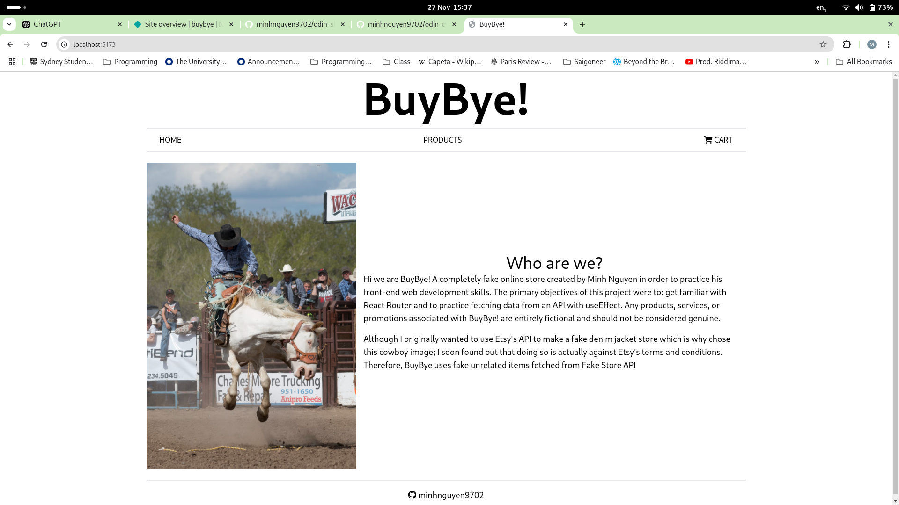
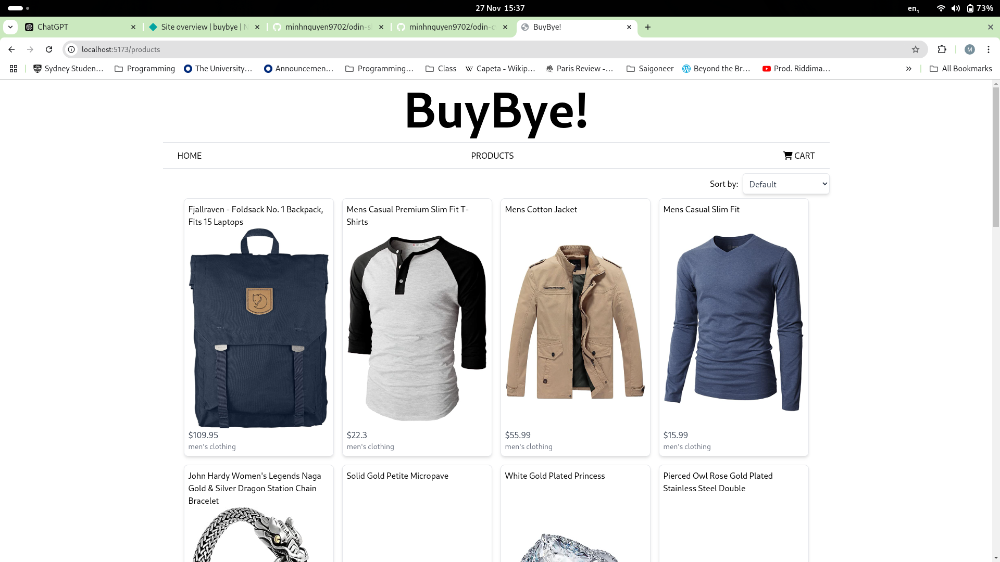
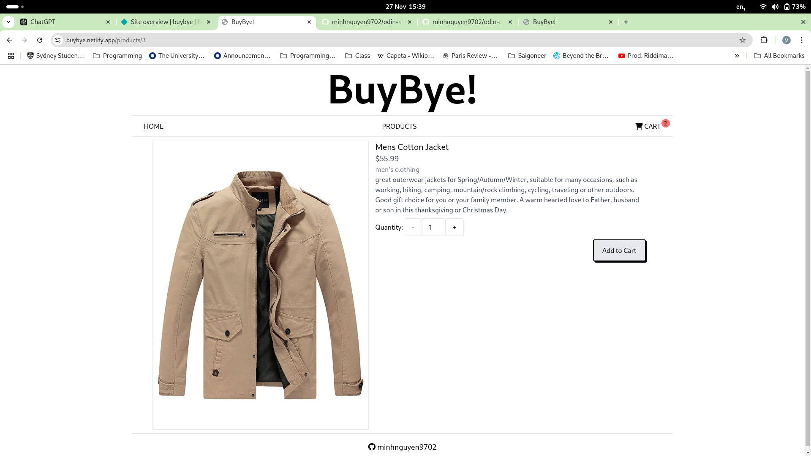
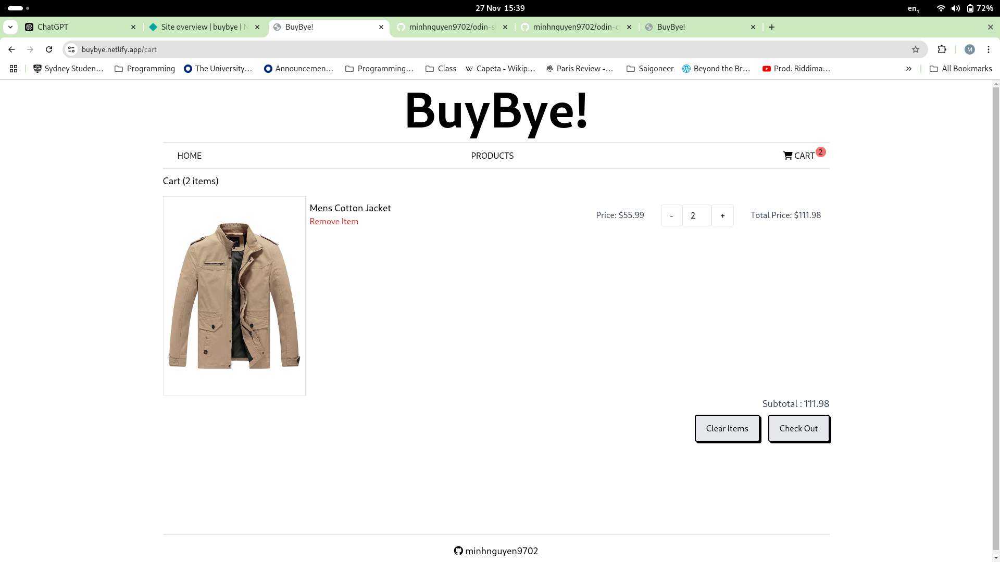

# BuyBye!

As part of the Odin Project's curriculum, I created a fake e-commerce website using React. The main purpose of this website was to put into practice what I learned about React Router and API fetching. In comparison to previous projects I have created with react, this project is both better styled and better designed. I tried to keep the code as modular and readable by reusing as much code as possible. With this project I also used Typescript instead of Javascript for the first time.

## Deploy

https://buybye.netlify.app/

## Screenshots

